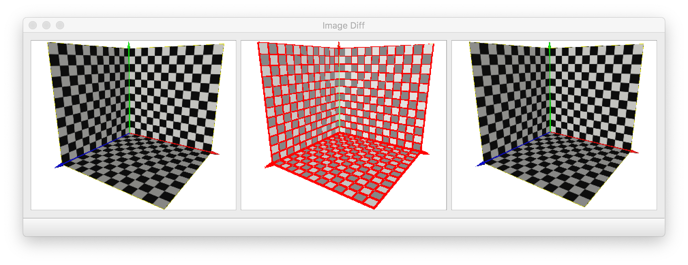

# ImageDiff
Visualize the differences between two images

## Executables
Pre-built binary files for Windows, Mac, and Linux can be downloaded [here](https://github.com/LiangliangNan/ImageDiff/releases).

If you want to build ImageDiff from the source code, you will need to install [Qt5](https://download.qt.io/archive/qt/5.14/5.14.2/).

## Usage
You can drag and drop image files onto the fields or double click to open images.

ImageDiff also has two optional command line arguments that allow you to load one or both images on startup.

Example:
`./ImageDiff a.png b.png`
